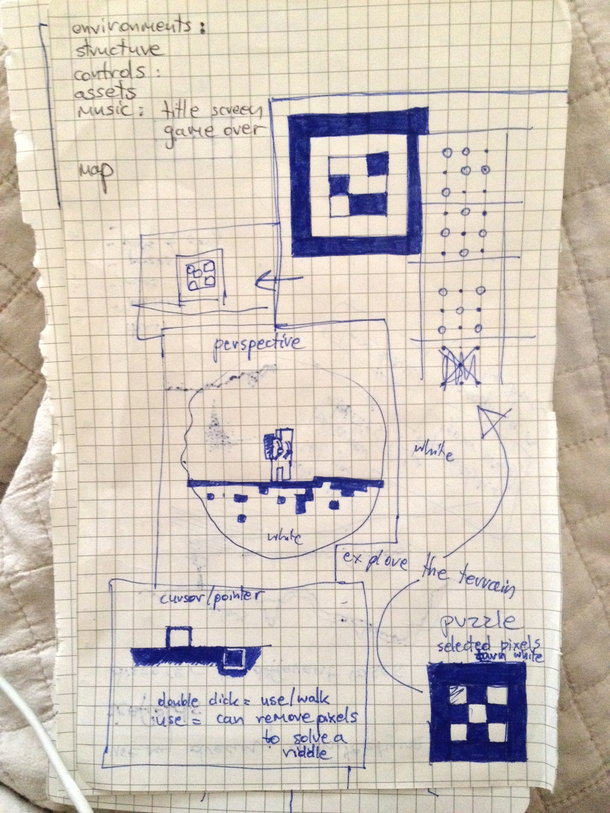

<a name="intro"></a>
# LITYLOAR - EXPLORATION GAME
lityloar
Hidden Information Game

https://cyberhippie.itch.io/lityloar

A game of maximum exploration, hidden information and minimal aesthetic.

Roam the minimalist landscape of a mysterious civilization visual aesthetic
Discover unexpected areas as an explorer locations
Solve puzzles that riddle the landscape mechanics
Enjoy the symphony of ambient sound sound
Create an environment that tells a story.
Make the environment as minimal as possible.
Leave the player with something to think about after they’re done.
Image cover area: 700 x 180

The inspiration from landscapes comes from a variety of borderline imagery that is based on the lines that are all over the visible spectrum (thing dust particles, think crusts and natural objects - non-human made). (?)


	

.png)	
	
	


Description.


Description.


### Table of Contents
1. [Introduction.](#intro)
2. [Features.](#features)
3. [Issues.](#issues)
4. [Icebox.](#icebox)
5. [Installation and usage guide.](#install)
6. [Contributing.](#contribute)
7. [License.](#license)
8. [Credits.](#credits)
9. [Commit Glyphs.](#glyphs)

<a name="features"></a>
### Features
+ Feature_01
+ Feature_02
+ Feature_03

<a name="issues"></a>
### Issues
+ Issue_01
+ Issue_02
+ Issue_03

<a name="icebox"></a>
### Icebox
+ There will be black on white (outside) and white on black areas (inside). Game will track how long you spend in the black version and when you access something (puzzle, item, whatever it may be) it will send a semi-visible monster after you coming from the dark space. The more you spend time in there the more weird it will get.
+ Idea_02
+ Idea_03

<a name="install"></a>
### Installation and Usage Guide
Include basic necessary components. Gifs if required.
```
1. 
2. 
3. 
```

<a name="contribute"></a>
### Contributing
Insert project contribution rules if allowed.

<a name="license"></a>
### License
Insert project licensing options if there are any.

<a name="credits"></a>
### Credits
Insert project creator entities, contributors and their respective presence links.

<a name="glyphs"></a>
### Commit Glyphs

+ ☰ Code structure and formatting
+ ▲ Performance improvements
+ ⨯ File deletion
+ ∗ Bugfix
+ ⬡ New Feature
+ ⎔ Documentation
+ ❑ UI design
+ ⚑ Release


